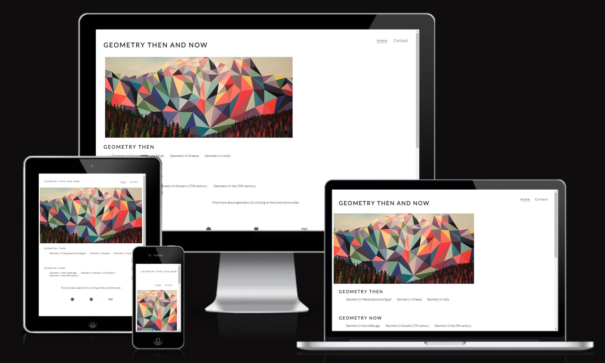
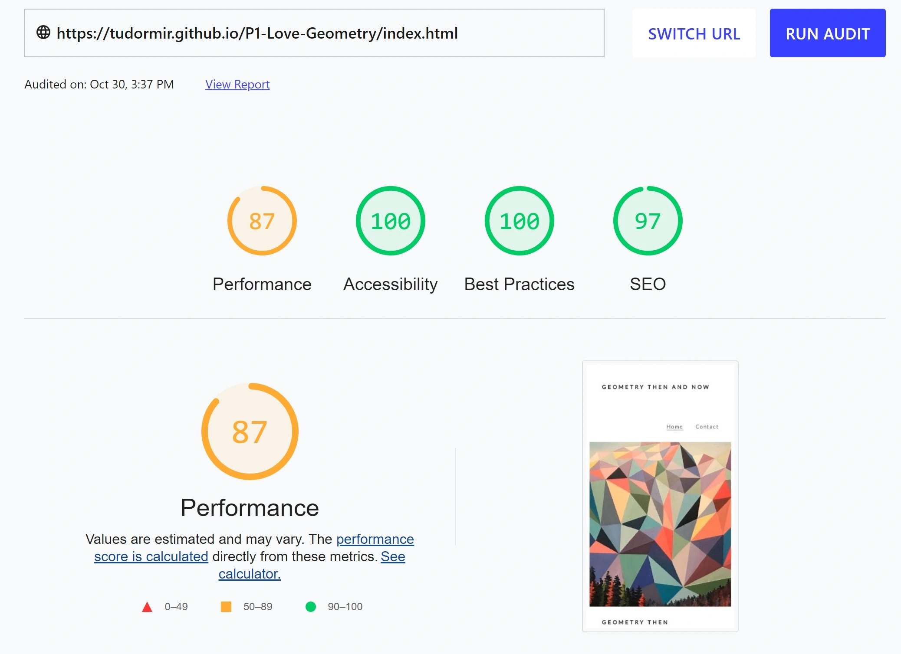

I am Mirela Tudor and this is my project Geometry then and now and my firts website.

My idea was to create a website about the history of Geometry. All the text and pictures that I used to create the six additional pages are from Wikipedia. Wikipedia is a free website, so I hope I didn't commit plagiarism. The webpages that I used from Wikipedia are the following:
From https://en.wikipedia.org/wiki/Geometry I took the text and the math related pictures. The webpages from the footer are the following:
- https://en.wikipedia.org/wiki/List_of_formulas_in_elementary_geometry
- https://en.wikipedia.org/wiki/List_of_geometry_topics
- https://en.wikipedia.org/wiki/Lists_of_mathematics_topics
The main image is from a Canadian website https://theculturetrip.com/north-america/canada/articles/canadian-artist-paints-famous-landscapes-with-geometric-patterns/ and the picture is called ‘Vermillion Lakes’, acrylic painting | © and courtesy of Elyse Dodge. The website have a copy-right policy. 

I have started by following the video about Love Running and bulding my own website.
In the begining I have used the code for the header on the main page from the Love Running video. Also I have used the code for the contact form.
When I started adding the main image I have begon changing the code. My first probleem starting with the image. The image didn't show because the file of the image was not in the images directory.
Another change was to have only two links in the header: Home and contact. Because I was using another six pages I tought I do not need the gallery. Instead I have six images added to the six secondary pages. 
I have seen that the property inherit wil apply the same colour to all the links, so I have use this property too, throughout the whole code.
I still not have added the code for small displays als phone's and ipad's. I have seen it how it is done during the video from Love Running, but I have not created one for my website.
I have added the images not with an id but with  command. It was easier for me.
I have not used the links to facebook or other media sites, instead I have used sites from Wikipedia about Geometry.     

I have today change the code for the six aditional pages to fit on smaller screens. Unfortunally I still don't know how to do it for the main image. I have found a way to do that, so it is working now.

My website is responsive, here is the image.

The website has been checked op the lighthouse and has the following score:

https://web.dev/measure/?url=https%3A%2F%2Ftudormir.github.io%2FP1-Love-Geometry%2Findex.html
Unfortunaly the image wil not upload, but hier is the path:
![My Image][def].
[def]: assets/images/accessibility.webp

W3c CSS validator
W3C CSS Validator Resultaten met object : https://tudormir.github.io/P1-Love-Geometry/index.html (CSS versie 3 + SVG)
Gefeliciteerd! Geen fouten gevonden. Sorry for some reasons is the answer in Dutch. It says that there are no mistakes.
Dit document is gevalideerd als CSS versie 3 + SVG ! This document is validated as CSS versie 3+SVG

Valide CSS!

    

            
Valide CSS!

    

        
This tool is an ongoing experiment in better HTML checking, and its behavior remains subject to change

Showing results for https://tudormir.github.io/P1-Love-Geometry/index.html
Checker Input
Show sourceoutlineimage report

Check by
address
https://tudormir.github.io/P1-Love-Geometry/index.html

Use the Message Filtering button below to hide/show particular messages, and to see total counts of errors and warnings.
Message Filtering
Warning: Section lacks heading. Consider using h2-h6 elements to add identifying headings to all sections, or else use a div element instead for any cases where no heading is needed.

From line 33, column 4; to line 33, column 27

ader>↩↩   <section id="art-outer">↩     
This site has been deployed to Github pages. After two day of vinding how to do it, here are the steps:
1. go to the page where you see all the file in your repository and where you see the green button Gitpod.
2. in the horizontal menu choose the last option settings.
3. on the left side of the page you see a menu, there you click on github pages
4. you enter the name of your page: in my case P1-Love-Geometry
5. you choose the option for source deploy from a branch, then you choose main, root and click on save.
6. after 2-3 minutes you do the steps 1, 2 and 3 again, and you see there is a link to the website.
The link to my project is: https://tudormir.github.io/P1-Love-Geometry/index.html
It took me a while untill I understood how the relative and asbolute links work. I have asked for help on Slack ask anything and I got a lot of help:
1. the difference between a relative and absolute path
2. where should the files be placed. I was not aware that all the *.html files in the root dir must be, and only the pictures and the css dir should be in assets directory.
Here I had another problem, I have used another namen for the assets dir. I have change that to.
Because the deployment didn't work the first time, I have learn that you need to set at step 5 everythink on none, main on none, root op none and save. 
Then do again the step 5.
The error I can not fix is to show images in README.md file.
It is a pity because I can not show the results of the responsiveness and accessibility.
I listen again to the video about README.md file and there was said that uploading images on the same way is done als in een *.html file.

